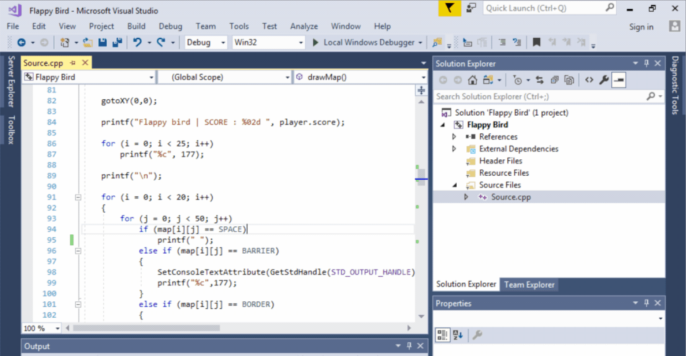

# Flappy-Bird
The game is a side-scroller where the player controls a bird, attempting to fly between borders without hitting them.

This game is written in pure C and it is only compatible with <b>Windows</b> OS.

